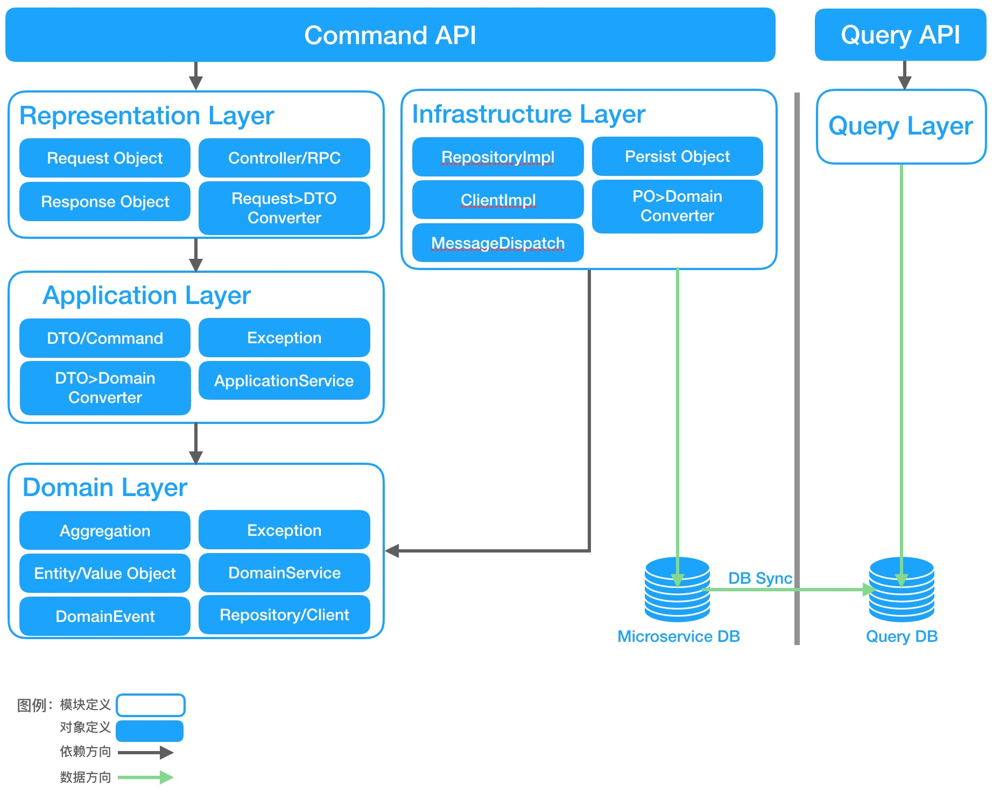
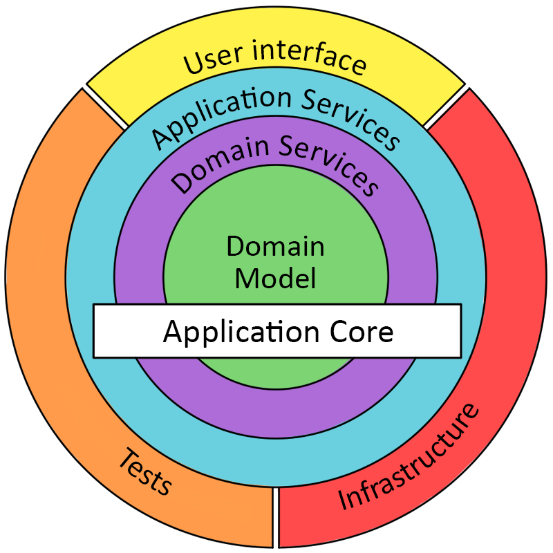

# ddd-code-samples

## Why We Coding This Sample
最近几乎整个IT界都在讨论DDD，但目前来看DDD在很多项目中还处于实践探索阶段，不同的团队产生的DDD实践风格迥异。
写这个sample的目的主要想把好几个项目中总结出来的经验以案例的形式分享出来，供大家在不同的项目中进行参考。
同时也希望能够帮助大家在新的项目中可以更好的借鉴已有经验，减少DDD在实现落地上的资源浪费。

## How To Start This Project

### Prepare Local Environment

1. 本地需要安装Java, 版本要求：jdk8+

    * MacOS
    * Windows
    * Linux
    
2. 本地需要安装Gradle， 版本要求：gradle5.4+
    * MacOS
    * Windows
    * Linux

### Run Application

1. 通过命令行

    * start 进入工程根目录下，执行 ```gradle bootRun```
    * stop  需要结束程序运行，直接在命令行工具中执行 ```ctrl+c``` 

2. 通过IDE工具(Intellij)

    导入工程到intellij工具中。

    * 工具栏运行按钮

    * gradle插件


## Project Structure



## Architecture Discussion Background

1.战术层面架构讨论基础基于Onion Architecture，定义四层代码结构：Representation层、Application层、Domain层、Infrastructure层。各层使用独立Jar包或Module强隔离，各层依赖顺序按图所示从外向内。
  
  
2.Representation层对象包括：
* 包括通过各种协议对外暴露的接口，该层内包含Request/Response对象定义（强制定义此对象，避免直接对外暴露领域对象）。但暂不对Request/Response外的其它DTO对象定义形式有要求，推荐可使用inner class或定义DTO class。
* 基于异常数据尽早拒绝服务的原则，该层包含数据格式校验逻辑，
* 该层包含convert对象定义，负责将Request/Response对象转换为Application层定义的DTO对象，装入Application层定义的Command中，以Application层定义的ApplicationService为入口操作。
* Representation层只包括Request/Response对象定义，统一使用Request/Response后缀。其可携带Application层定义的DTO对象。

3.Test层定义：
* Test中可包含测试金子塔的4类测试，即单元测试、持久层测试、接口层测试、契约测试。
* 如下建议可参考：单元测试是基础；持久层测试运行耗时久且易于发现可省略；接口层测试运行耗时久可考虑在端到端自动化测试中。

4.Application层对象包括：
* 用于入参/出参的DTO类型定义；
* 用于携带DTO数据的Command类型定义；
* 用于异常返回的Exception类型定义；
* ApplicationService类型定义，用于接收并处理Command；在ApplicationService中可使用Domain层定义的的Entity、DomainService、Repository上的方法；Transaction处理；发送DomainEvent；
* Application层包括DTO对象定义，统一使用Request/Response后缀，入口方法使用DTO对象作为入参和出参。

5.Domain层对象包括：
* Aggregation、Entity、ValueObject类型定义；
* 用于依赖反转的Repository、Client接口类型定义；
* DomainEvent和其携带的DTO数据类型定义在共享包中，在Domain层完成DomainEvent产生；
* Domain层Aggregation、Entity、ValueObject等对象不使用后缀；
   * Domain层可定义Domain Exception；
   * Domain Event定义在Domain层（而非之前说的共享包）；Domain Event由Application层显示的发出（Optional）

6.Infrastructure层对象包括：
* 对Domain层定义的Repository的实现类RepositoryImpl，其内部包括JpaRepository；
* 对Domain层定义的Client的实现类ClientImpl，负责加载外部接口数据；
* 消息发送实现类；
* Convert类，用于将DB，第三方数据契约等数据对象转换为Domain层对象；
* Infrastructure层中定义的数据库实体对象统一使用PO（Persist Object）后缀